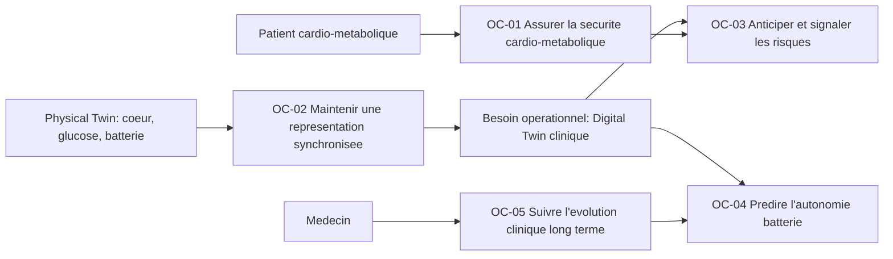
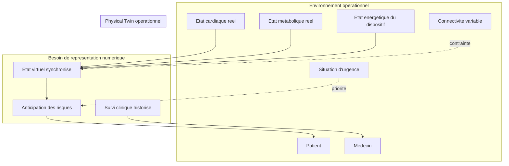
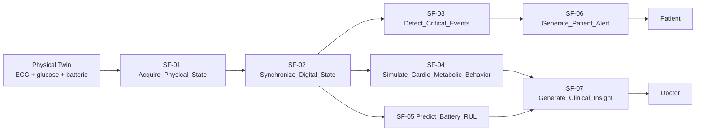
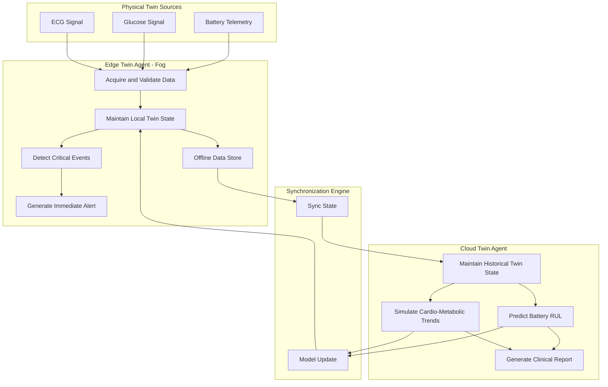
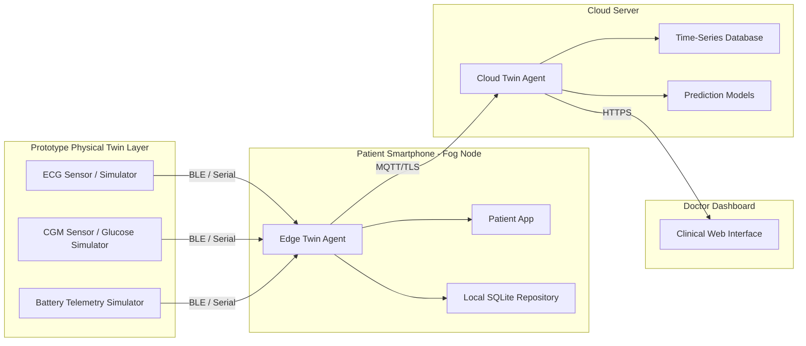
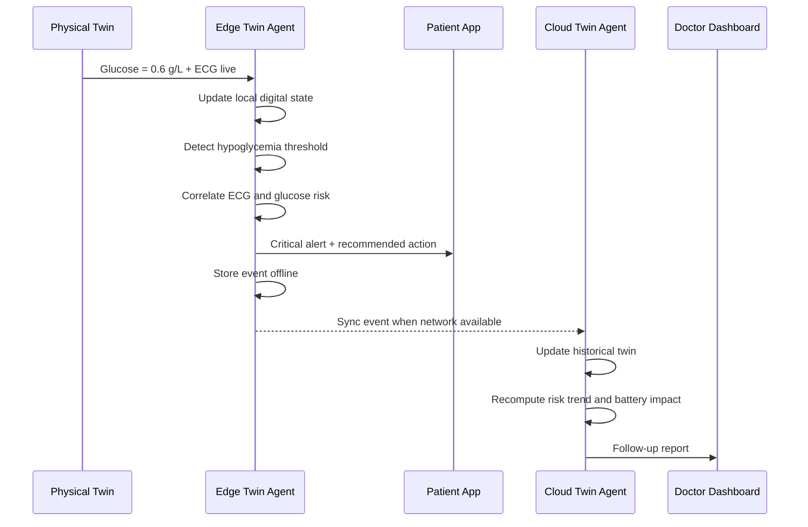

# Chapitre 4 - Modélisation du système Smart TwinPac avec ARCADIA/Capella

## 4.1 Introduction

Le chapitre précédent a défini le **Smart TwinPac Framework** comme une architecture conceptuelle de jumeau numérique médical. Cette architecture repose sur trois idées principales : le **Physical Twin**, qui représente la réalité cardio-métabolique et énergétique du patient ; le **Digital Twin**, qui maintient une représentation numérique dynamique de cette réalité ; et une boucle de contrôle inspirée de **MAPE-K**, permettant de passer d'une simple surveillance à une assistance proactive.

Cependant, le chapitre 3 reste volontairement conceptuel. Il décrit les composants, les flux et les mécanismes de contrôle, mais il ne montre pas encore comment transformer cette vision en architecture opérationnelle vérifiable. Pour passer du framework au système, il faut une méthode capable de répondre progressivement aux questions suivantes :

- dans quel environnement le système agit-il ?
- quels acteurs et contraintes influencent son fonctionnement ?
- quelles fonctions le système doit-il fournir ?
- comment le Digital Twin est-il réparti entre Fog et Cloud ?
- sur quels composants physiques et logiciels ces fonctions sont-elles déployées ?
- comment vérifier que les exigences de sûreté, de latence et de continuité sont bien couvertes ?

Pour répondre à ces questions, ce chapitre adopte la méthode **ARCADIA** avec l'outil **Capella**. Contrairement à une approche purement descriptive, ARCADIA impose une progression structurée : **Analyse Opérationnelle (OA)**, **Analyse Système (SA)**, **Architecture Logique (LA)** et **Architecture Physique (PA)**. Cette progression permet de construire le système pièce par pièce, depuis l'environnement clinique jusqu'au déploiement logiciel et matériel.

L'objectif de ce chapitre n'est donc pas seulement de dessiner une architecture. Il est de montrer comment le concept de **Physical Twin / Digital Twin** apparaît dès l'étude de l'environnement, puis se transforme progressivement en fonctions système, composants logiques Fog/Cloud, et noeuds physiques de déploiement.

## 4.2 Positionnement méthodologique : ARCADIA pour un lecteur UML/SysML

Pour un lecteur habitué à UML ou SysML, ARCADIA peut sembler inhabituelle car elle ne commence pas directement par les classes, les blocs ou les composants logiciels. Elle commence par l'environnement et les besoins opérationnels. Cette logique est essentielle dans un système médical critique : avant de concevoir le logiciel, il faut comprendre la situation réelle que le système doit maîtriser.

Dans UML/SysML, un ingénieur pourrait commencer par un diagramme de blocs représentant un smartphone, un serveur cloud, un pacemaker et une base de données. Cette représentation est utile, mais elle arrive trop tôt si les besoins opérationnels ne sont pas encore stabilisés. ARCADIA impose au contraire la question suivante : **pourquoi ces composants sont-ils nécessaires ?**

La correspondance utilisée dans ce chapitre est la suivante.

| Logique UML/SysML | Logique ARCADIA/Capella | Rôle dans Smart TwinPac |
|---|---|---|
| Use Case Diagram | Operational Capability Blank (OCB) | Identifier les capacités attendues par le patient et le médecin |
| Context Diagram | Operational Architecture Blank (OAB) | Montrer l'environnement clinique, biologique, technique et humain |
| Requirements Diagram | Requirements + Mission/Capability links | Relier les exigences aux capacités opérationnelles |
| Activity Diagram | Functional Chain / Exchange Scenario | Décrire les scénarios critiques |
| Block Definition Diagram | Logical Architecture Blank (LAB) | Décomposer le système en agents logiques |
| Internal Block Diagram | Logical/Physical Data Flow | Décrire les échanges internes |
| Deployment Diagram | Physical Architecture Blank (PAB) | Déployer les composants sur smartphone, cloud, capteurs et interfaces |

Ainsi, ARCADIA ne remplace pas complètement la logique UML/SysML. Elle l'organise dans un processus plus strict. Le lecteur peut considérer OA comme l'équivalent d'une étude de contexte et de cas d'utilisation, SA comme la définition fonctionnelle de la boîte noire, LA comme l'architecture logicielle logique, et PA comme le déploiement technique.

## 4.3 Fil conducteur du chapitre : faire apparaître le Physical Twin et le Digital Twin dans toutes les phases

La demande principale de cette modélisation est de ne pas limiter le Digital Twin à un simple composant visible uniquement dans l'architecture physique. Dans Smart TwinPac, le Digital Twin est un **principe architectural transversal**. Il apparaît progressivement dans chaque phase ARCADIA :

| Phase ARCADIA | Question | Apparition du Physical Twin | Apparition du Digital Twin |
|---|---|---|---|
| OA | Pourquoi ? Dans quel environnement ? | Patient, coeur, métabolisme, batterie, pacemaker, capteurs | Besoin d'une représentation clinique virtuelle pour anticiper les risques |
| SA | Que doit faire le système ? | Acquisition ECG, glucose, batterie | Fonctions de simulation, corrélation, prédiction et synchronisation |
| LA | Comment organiser le système ? | Source temps réel de données biologiques et énergétiques | Edge Twin Agent + Cloud Twin Agent + Knowledge Repository |
| PA | Où déployer ? | Capteurs, pacemaker simulé, smartphone patient | Fog sur smartphone, Cloud sur serveur, dashboard médecin |
| ES | Comment valider ? | Evénement réel : hypoglycémie/bradycardie | Détection, simulation, alerte, recommandation, synchronisation |

Cette table doit être placée au début du chapitre afin d'éviter une incompréhension fréquente : en OA, on ne modélise pas encore les composants logiciels du Digital Twin, mais on modélise déjà **la nécessité opérationnelle** d'un jumeau numérique. Le Digital Twin devient ensuite fonctionnel en SA, logique en LA, et déployé en PA.

### 4.3.1 Liste des diagrammes à produire dans Capella

Pour éviter que le lecteur ait l'impression que le Digital Twin apparaît seulement à la fin, les diagrammes doivent être présentés comme une chaîne continue. Chaque diagramme doit contenir explicitement un indice visuel du couple Physical Twin / Digital Twin.

| Figure | Diagramme Capella | Message principal | Ce que la superviseure doit voir |
|---|---|---|---|
| Figure 4.1 | OCB - Operational Capability Blank | Les besoins viennent de l'environnement clinique réel | Patient, médecin, Physical Twin, besoin de Digital Twin synchronisé |
| Figure 4.2 | OAB - Operational Architecture Blank | L'environnement est biologique, médical, humain et technique | Coeur, glucose, batterie, urgence, connectivité, suivi médical |
| Figure 4.3 | SAB - System Architecture Blank | Le système transforme l'état physique en état numérique exploitable | Acquisition, synchronisation, détection, simulation, prédiction |
| Figure 4.4 | MCB / Capability Realization | Les fonctions système réalisent les capacités opérationnelles | OC-01 vers détection Edge, OC-04 vers prédiction Cloud |
| Figure 4.5 | LAB - Logical Architecture Blank | Le Digital Twin est distribué entre Fog et Cloud | Edge Twin Agent, Cloud Twin Agent, Synchronization Engine |
| Figure 4.6 | Logical Data Flow Blank | Le thread digital synchronise les deux parties du twin | Sync_State, Model_Update, Alert_Event, Clinical_Report |
| Figure 4.7 | PAB - Physical Architecture Blank | Les composants logiques sont déployés sur des noeuds physiques | Smartphone, Cloud Server, capteurs/prototype, dashboard |
| Figure 4.8 | Exchange Scenario | Le scénario critique valide la séparation Edge/Cloud | Réaction locale immédiate puis enrichissement Cloud |
| Figure 4.9 | Traceability Matrix | Chaque exigence est reliée à une capacité, une fonction et un composant | REQ-DT-01 et REQ-SAFE-xx traçables de OA à PA |

Cette liste peut être utilisée directement comme plan de figures du chapitre. Elle rend la méthode plus lisible pour un lecteur habitué à UML : chaque diagramme ajoute un niveau de détail au diagramme précédent.

## 4.4 Analyse Opérationnelle (OA) : étude de l'environnement

### 4.4.1 Objectif de l'OA

L'Analyse Opérationnelle étudie le système dans son environnement avant de définir sa solution technique. Dans le cas de Smart TwinPac, l'environnement n'est pas seulement informatique. Il est composé d'éléments biologiques, médicaux, humains et techniques.

L'environnement opérationnel comprend :

- le patient vivant avec une condition cardio-métabolique variable ;
- le coeur, le rythme cardiaque et les épisodes d'arythmie ;
- le niveau de glucose et les épisodes d'hypoglycémie ou d'hyperglycémie ;
- le dispositif de stimulation et sa contrainte énergétique ;
- le médecin chargé du suivi clinique ;
- les situations d'urgence nécessitant une alerte rapide ;
- les contraintes de connectivité, notamment les périodes hors ligne ;
- les données historiques nécessaires au suivi long terme.

Dans cette phase, le **Physical Twin** correspond à la réalité observable : patient, coeur, métabolisme, batterie et signaux mesurés. Le **Digital Twin** n'est pas encore une architecture logicielle ; il apparaît comme un besoin opérationnel : disposer d'une représentation numérique fiable permettant de comprendre, anticiper et suivre l'état réel.

### 4.4.2 Diagramme OCB - Operational Capability Blank

Le diagramme OCB doit montrer les capacités opérationnelles attendues. Pour rendre le Digital Twin visible dès ce premier diagramme, les capacités doivent être formulées autour de la relation entre réalité physique et représentation numérique.

**Interprétation du diagramme.**  
Le Physical Twin est visible comme l'ensemble réel à surveiller : coeur, glucose et batterie. Le Digital Twin est visible non pas encore comme un logiciel, mais comme une capacité opérationnelle de représentation synchronisée. Cette représentation permet ensuite les alertes, les recommandations et les prédictions.

Capacités opérationnelles proposées :

- **OC-01 Ensure_Cardio_Metabolic_Safety** : garantir la sécurité cardio-métabolique du patient en détectant les situations critiques.
- **OC-02 Maintain_Synchronized_Twin_State** : maintenir une représentation numérique synchronisée avec l'état réel du patient et du dispositif.
- **OC-03 Deliver_Proactive_Alerts** : anticiper les risques et déclencher des alertes exploitables.
- **OC-04 Predict_Device_Energy_Degradation** : estimer l'évolution de la batterie et prévenir les défaillances.
- **OC-05 Support_Clinical_Follow_Up** : fournir au médecin une vision consolidée de l'évolution du patient.

Cette formulation répond directement à la critique selon laquelle l'environnement n'était pas visible. Le diagramme part de l'environnement réel, puis montre pourquoi le système a besoin d'un jumeau numérique.

### 4.4.3 Diagramme OAB - Operational Architecture Blank

Le diagramme OAB doit représenter les entités de l'environnement et leurs interactions. Contrairement au PAB, il ne montre pas encore smartphone, MQTT, SQLite ou AWS comme choix techniques principaux. Il montre d'abord les rôles opérationnels.

**Interprétation du diagramme.**  
Ce diagramme montre l'environnement demandé par la superviseure. Le système n'est pas encore une solution technique ; il est situé dans un environnement où les données biologiques, métaboliques et énergétiques évoluent. Le besoin central est la création d'un état virtuel synchronisé, capable de relier les événements physiques aux décisions cliniques.

## 4.5 Analyse Système (SA) : le système comme boîte noire

### 4.5.1 Objectif de la SA

L'Analyse Système définit ce que Smart TwinPac doit faire, sans encore décrire comment il est construit en interne. Le système est vu comme une boîte noire qui reçoit des données du Physical Twin et fournit des services au patient et au médecin.

Dans cette phase, le Digital Twin devient visible à travers des fonctions système :

- capturer les données du Physical Twin ;
- maintenir un état numérique synchronisé ;
- détecter les anomalies immédiates ;
- simuler les comportements cardiaques et métaboliques ;
- prédire l'autonomie énergétique ;
- produire des alertes, recommandations et rapports.

### 4.5.2 Diagramme SAB - System Architecture Blank

**Interprétation du diagramme.**  
Le diagramme SAB rend le Digital Twin visible comme un ensemble de fonctions, et non encore comme des composants. La fonction centrale est **Synchronize_Digital_State**, car elle transforme les données physiques en état numérique exploitable. Les fonctions de simulation et de prédiction expriment le coeur du Digital Twin.

Fonctions système recommandées :

| ID | Fonction système | Entrée | Sortie | Rôle DT/PT |
|---|---|---|---|---|
| SF-01 | Acquire_Physical_State | ECG, glucose, batterie | flux bruts validés | Capture du Physical Twin |
| SF-02 | Synchronize_Digital_State | flux validés | état numérique courant | Construction du Digital Twin |
| SF-03 | Detect_Critical_Events | état courant | événement critique | Analyse Edge immédiate |
| SF-04 | Simulate_Cardio_Metabolic_Behavior | historique + état courant | risque physiologique | Simulation Digital Twin |
| SF-05 | Predict_Battery_RUL | télémétrie batterie | autonomie prédite | Modèle énergétique |
| SF-06 | Generate_Patient_Alert | événement critique | alerte patient | sûreté immédiate |
| SF-07 | Generate_Clinical_Insight | historique + prédictions | rapport médecin | suivi long terme |

### 4.5.3 Exigences système

| ID | Exigence | Allocation fonctionnelle | Justification |
|---|---|---|---|
| REQ-SAFE-01 | Détecter une anomalie cardiaque critique en moins de 1 s | SF-03 | Fonction locale, déterministe, indépendante du Cloud |
| REQ-SAFE-02 | Détecter un seuil glycémique critique en moins de 2 s | SF-03 | Corrélation glucose/rythme dans l'Edge |
| REQ-SAFE-03 | Maintenir les alertes en mode hors ligne | SF-06 | Continuité de sûreté sans connectivité |
| REQ-DT-01 | Maintenir un état numérique synchronisé du patient | SF-02 | Exigence centrale du Digital Twin |
| REQ-PERF-01 | Prédire l'autonomie batterie avec marge d'erreur définie | SF-05 | Modèle prédictif Cloud |
| REQ-CLIN-01 | Fournir un rapport de suivi au médecin | SF-07 | Suivi clinique long terme |

## 4.6 Architecture Logique (LA) : organisation du Digital Twin Fog/Cloud

### 4.6.1 Objectif de la LA

L'Architecture Logique ouvre la boîte noire. Elle répond à la question : comment organiser le système pour satisfaire à la fois les contraintes de sûreté immédiate et les besoins d'analyse prédictive ?

Le choix architectural principal est un **Digital Twin hiérarchique distribué** :

- un **Edge Twin Agent** proche du patient, chargé de la sûreté immédiate ;
- un **Cloud Twin Agent** chargé des simulations plus lourdes et de l'analyse historique ;
- un **Knowledge Repository** partagé, qui conserve l'historique, les modèles et les décisions ;
- un **Synchronization Engine** qui maintient la cohérence entre Edge et Cloud.

Cette architecture reprend la logique du chapitre 3 : les fonctions réactives de MAPE-K restent au Fog/Edge, tandis que les fonctions prédictives et historiques sont placées dans le Cloud.

### 4.6.2 Diagramme LAB - Logical Architecture Blank

**Interprétation du diagramme.**  
Ce diagramme est le plus important pour expliquer le Digital Twin. Il montre que le Digital Twin n'est pas un seul bloc isolé. Il est distribué entre Edge et Cloud. L'Edge Twin maintient une copie locale minimale et réactive de l'état du patient. Le Cloud Twin maintient une copie historique plus riche, utilisée pour les prédictions et le suivi médical.

### 4.6.3 Justification de l'allocation Fog/Cloud

| Critère | Edge Twin / Fog | Cloud Twin |
|---|---|---|
| Latence | Inférieure à 1 ou 2 s | Plusieurs minutes acceptables |
| Connectivité | Doit fonctionner hors ligne | Dépend de la connexion |
| Criticité | Alertes vitales | Analyse consultative |
| Données | Fenêtre courte, données temps réel | Historique long terme |
| Algorithmes | Seuils, règles, modèles légers | LSTM, modèles statistiques, apprentissage |
| Sortie | Alerte patient immédiate | Rapport médecin, tendance, prédiction |

Cette séparation rend le système compréhensible pour un ingénieur logiciel : l'Edge agit comme un service local critique, tandis que le Cloud agit comme un service analytique non temps réel.

## 4.7 Architecture Physique (PA) : déploiement logiciel et matériel

### 4.7.1 Objectif de la PA

L'Architecture Physique décrit où les composants logiques sont réellement déployés. Dans le cadre de ce travail, les composants matériels doivent être interprétés comme une **plateforme expérimentale de validation** et non comme une implantation médicale certifiée.

Cette précision est importante : un ESP32, un MAX30102 ou un smartphone ne constituent pas directement une architecture de pacemaker implantable certifiée. Ils servent à prototyper les flux de données, la latence, la synchronisation et les scénarios de démonstration.

### 4.7.2 Diagramme PAB - Physical Architecture Blank

**Interprétation du diagramme.**  
Le Physical Twin est représenté par les sources de données physiques ou simulées : ECG, glucose et batterie. Le Digital Twin est déployé en deux parties : Edge Twin Agent sur le smartphone du patient et Cloud Twin Agent sur le serveur. La synchronisation MQTT/TLS représente le thread digital qui relie les deux niveaux.

### 4.7.3 Déploiement des composants

| Composant logique | Noeud physique | Raison |
|---|---|---|
| Edge Twin Agent | Smartphone patient | Latence faible, proximité patient, mode hors ligne |
| Local Twin State | SQLite local | Continuité en absence de réseau |
| Cloud Twin Agent | Serveur cloud | Calcul prédictif et historique long terme |
| Historical Twin Repository | Base de données temporelle | Stockage des tendances patient |
| Patient Alert Interface | Application mobile | Notification immédiate |
| Doctor Follow-up Interface | Dashboard web | Suivi clinique et validation médicale |

## 4.8 Scénario de validation : hypoglycémie avec risque de bradycardie

### 4.8.1 Correction importante : assistance et non contrôle thérapeutique autonome

Pour rester cohérent avec le chapitre 3, le scénario doit être présenté comme un scénario **Human-in-the-Loop**. Le système peut détecter, simuler, recommander et alerter, mais il ne doit pas être décrit comme commandant directement le pacemaker dans une version médicale réelle.

La version recommandée est donc :

- le Physical Twin produit une chute de glucose ;
- l'Edge Twin détecte le seuil critique ;
- l'Edge Twin corrèle le risque avec le rythme cardiaque ;
- le Digital Twin simule ou estime le risque de bradycardie ;
- le système envoie une alerte immédiate au patient ;
- le médecin reçoit ensuite le rapport de suivi ;
- le Cloud Twin met à jour l'historique et les modèles.

### 4.8.2 Exchange Scenario

**Interprétation du scénario.**  
Ce scénario valide la séparation Edge/Cloud. L'alerte vitale est produite localement sans attendre le Cloud. Le Cloud intervient ensuite pour enrichir le suivi clinique et améliorer les prédictions. Cela permet de respecter la contrainte de latence tout en conservant la valeur du Digital Twin long terme.

## 4.9 Matrice de traçabilité

| Exigence | Capacité OA | Fonction SA | Composant LA | Déploiement PA | Vérification |
|---|---|---|---|---|---|
| REQ-SAFE-01 Détection cardiaque rapide | OC-01 | SF-03 Detect_Critical_Events | Edge Twin Agent | Smartphone/Fog | Test latence locale |
| REQ-SAFE-02 Détection glucose critique | OC-01 | SF-03 Detect_Critical_Events | Edge Twin Agent | Smartphone/Fog | Test seuil |
| REQ-SAFE-03 Mode hors ligne | OC-01 / OC-02 | SF-06 Generate_Patient_Alert | Local Twin State + Offline Store | SQLite local | Test déconnexion |
| REQ-DT-01 Etat numérique synchronisé | OC-02 | SF-02 Synchronize_Digital_State | Synchronization Engine | MQTT/TLS | Test cohérence état |
| REQ-PERF-01 Prédiction batterie | OC-04 | SF-05 Predict_Battery_RUL | Cloud Twin Agent | Cloud Server | MAE prédiction |
| REQ-CLIN-01 Rapport médecin | OC-05 | SF-07 Generate_Clinical_Insight | Cloud Twin Agent | Dashboard Web | Revue clinique |

Cette matrice montre que le Digital Twin est traçable depuis le besoin opérationnel jusqu'au déploiement. L'exigence REQ-DT-01 est centrale : elle formalise le fait que le système ne se limite pas à collecter des données, mais maintient une représentation numérique synchronisée du Physical Twin.

## 4.10 Comment lire les diagrammes comme une progression unique

Pour rendre la méthode simple à comprendre, il faut expliquer les diagrammes comme une histoire continue :

1. **OCB** : le patient, le médecin et le Physical Twin créent le besoin d'un Digital Twin.
2. **OAB** : l'environnement opérationnel montre les états réels, les contraintes réseau, les urgences et le suivi clinique.
3. **SAB** : le système transforme ce besoin en fonctions : acquisition, synchronisation, détection, simulation, prédiction, alerte.
4. **LAB** : les fonctions sont organisées en Edge Twin Agent et Cloud Twin Agent.
5. **PAB** : les agents sont déployés sur smartphone, cloud, capteurs et dashboard.
6. **ES** : le scénario critique vérifie que l'Edge répond vite et que le Cloud enrichit le suivi.
7. **Traceability Matrix** : chaque exigence est reliée à une capacité, une fonction, un composant et une vérification.

Cette progression permet à un lecteur UML/SysML de comprendre ARCADIA comme une modélisation par raffinement. On ne dessine pas tout dès le début. On part du monde réel, puis on ajoute progressivement la solution.

## 4.11 Limites de la modélisation

Cette modélisation constitue une preuve architecturale, mais elle ne remplace pas une validation médicale ou réglementaire complète. ARCADIA facilite la traçabilité nécessaire à une démarche de conformité IEC 62304 ou ISO 14971, mais ne constitue pas à elle seule une preuve de conformité.

Les limites principales sont :

- les composants matériels proposés sont des éléments de prototypage et non des dispositifs implantables certifiés ;
- les modèles prédictifs doivent être validés expérimentalement sur des jeux de données représentatifs ;
- la sûreté d'un contrôle thérapeutique autonome nécessiterait une vérification formelle plus avancée ;
- la tolérance aux partitions réseau doit être testée expérimentalement ;
- la cybersécurité médicale doit être détaillée dans une phase dédiée.

Ces limites orientent naturellement le chapitre suivant vers l'implémentation expérimentale, la mesure de latence, la validation des modèles de prédiction et l'évaluation de la cohérence du Digital Twin distribué.

## 4.12 Conclusion

Ce chapitre a transformé le Smart TwinPac Framework du chapitre 3 en une architecture système structurée selon la méthode ARCADIA. L'apport principal est la mise en continuité du concept **Physical Twin / Digital Twin** à travers toutes les phases de modélisation.

L'Analyse Opérationnelle a montré l'environnement réel : patient, état cardiaque, état métabolique, batterie, médecin, urgence et connectivité variable. L'Analyse Système a traduit cet environnement en fonctions de synchronisation, de détection, de simulation et de prédiction. L'Architecture Logique a organisé ces fonctions dans un Digital Twin hiérarchique composé d'un Edge Twin Agent et d'un Cloud Twin Agent. L'Architecture Physique a ensuite montré le déploiement expérimental sur smartphone, cloud, capteurs et dashboard.

La séparation Fog/Cloud constitue le choix architectural central. Les fonctions critiques et rapides sont allouées à l'Edge afin de garantir la sûreté et le fonctionnement hors ligne. Les fonctions prédictives et historiques sont allouées au Cloud afin d'exploiter davantage de données et de puissance de calcul. Cette répartition permet de concilier réactivité médicale, suivi long terme et évolutivité.

Enfin, le scénario d'hypoglycémie avec risque de bradycardie illustre la valeur du Digital Twin distribué : le Physical Twin produit un événement réel, l'Edge Twin réagit immédiatement, puis le Cloud Twin enrichit l'analyse clinique. Le système obtenu n'est donc pas une simple plateforme de télémétrie, mais une architecture de jumeau numérique médical structurée, traçable et préparée pour la validation expérimentale.
